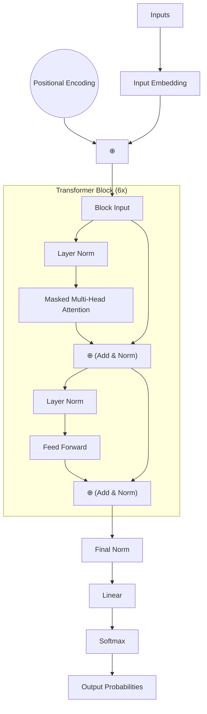

# GPT-2: Custom 11.5M Parameter Decoder-Only Transformer

This project is a complete, custom implementation of a decoder-only Transformer language model modeled after the GPT-2 architecture. The goal of this project was to design, train, and evaluate a lightweight yet mathematically complete autoregressive text generation model. The model is trained on the **Tiny Shakespeare** dataset and includes a custom subword tokenizer, an optimized training pipeline, and an interactive FastAPI-powered web playground for model evaluation and inference parameter tuning.

---

## 🔗 Live Demo
You can interact with the trained model directly in your browser:
👉 **[Live GPT-2 Playground Interface](https://gpt-2-qeww.onrender.com)**

> [!WARNING]
> The live demo is hosted on the **Render Free Tier** (restricted to **0.1 CPU**). 
> Because autoregressive text generation runs a forward pass of the model for *each* generated token, requesting a large sequence (e.g. 100+ tokens) may take over 100 seconds and trigger Render's gateway timeout.
> 
> **For testing the live link, please set the "Max Tokens" slider to 20–30 tokens.** To generate larger texts quickly, run the project locally on your machine using the steps below.

---

## 📐 Architecture Design & Implementation

The network is composed of custom PyTorch layers written from scratch to ensure architectural transparency and flexibility.



### 1. Embeddings ([embeddings.py](embeddings.py))
* **Token Embeddings (`wte`):** Maps token indices to a continuous vector space ($d_{model} = 384$).
* **Positional Embeddings (`wpe`):** Implements learned absolute positional embeddings to represent sequential ordering up to the context block size ($T_{max} = 256$). Token and positional embeddings are summed element-wise to form the initial sequence representation.

### 2. Pre-LN Transformer Blocks ([transformer.py](transformer.py))
The architecture employs a **Pre-Layer Normalization (Pre-LN)** topology, which applies normalization before self-attention and feed-forward layers. This is highly stable for gradient flow during training, compared to Post-LN architectures:
$$\mathbf{x}_{1} = \mathbf{x} + \text{Attention}(\text{LayerNorm}(\mathbf{x}))$$
$$\mathbf{x}_{2} = \mathbf{x}_{1} + \text{MLP}(\text{LayerNorm}(\mathbf{x}_{1}))$$

### 3. Multi-Head Self-Attention ([attention.py](attention.py))
* **Parallel Query-Key-Value Projection:** Instead of projecting $Q$, $K$, and $V$ through three separate linear layers, they are projected using a single combined linear layer (`c_attn`) with output dimension $3 \times d_{model}$ to maximize GPU memory efficiency.
* **Causal Masking:** A lower-triangular causal mask is constructed dynamically:
  $$\mathbf{M}_{ij} = \begin{cases} 0 & \text{if } i \ge j \\ -\infty & \text{if } i < j \end{cases}$$
  This is applied to attention logits before softmax, preventing the model from attending to future tokens during autoregressive generation.
* **Scaled Dot-Product Attention:** Scores are scaled by $\frac{1}{\sqrt{d_{head}}}$ to prevent gradients from vanishing in the softmax layer.

### 4. Custom Normalization & MLP Layers ([layers.py](layers.py))
* **Custom LayerNorm:** Implements standard layer normalization from scratch:
  $$\text{LN}(x) = \gamma \odot \frac{x - \mu}{\sqrt{\sigma^2 + \epsilon}} + \beta$$
* **Approximated GELU Activation:** To match the original GPT-2 configuration, a custom Gaussian Error Linear Unit (GELU) approximation is used:
  $$\text{GELU}(x) = 0.5x \times \left(1 + \tanh\left(\sqrt{\frac{2}{\pi}} \left(x + 0.044715x^3\right)\right)\right)$$
* **Feed-Forward Block:** Projects the token representation from $d_{model}$ to $4 \times d_{model}$, applies GELU activation, projects back to $d_{model}$, and applies residual dropout.

### 5. Parameter Optimization: Weight Tying
To reduce parameter storage and regularize the model, the weights of the input token embedding layer (`wte`) and the output projection head (`lm_head`) are tied:
$$\mathbf{W}_{lm\_head} = \mathbf{W}_{wte}^T$$
This shared matrix reduces the total parameter count by approximately 30% (saving $\approx 19.3$ million weights on a standard vocabulary).

---

## ⚙️ Tokenizer Pipeline ([tokenizer.py](tokenizer.py))

* **SentencePiece Subword BPE:** Instead of using simple character-level mapping, the model utilizes a subword SentencePiece tokenizer trained from scratch on the raw corpus text.
* **Vocabulary Size:** Configured to a compact vocabulary size ($V = 1000$) tailored to the training set volume (Tiny Shakespeare). This forces the network to learn rich semantic relationships rather than simple character sequences.

---

## 🏋️ Optimization & Training Pipeline ([trainer.py](trainer.py), [train.py](train.py))

The training script integrates several deep learning optimization techniques:

1. **AdamW Optimizer:** Standardized weight decay ($0.2$) is decoupled from gradient updates to prevent $L_2$ regularization from degrading gradients.
2. **Learning Rate Scheduler:** Uses a cosine annealing learning rate decay with a linear warmup phase:
   * **Warmup:** Increases linearly from $0$ to $4\times 10^{-4}$ over the first $200$ iterations.
   * **Cosine Decay:** Decays the learning rate down to a minimum threshold ($10\%$ of peak LR) at the maximum iteration limit.
3. **Automatic Mixed Precision (AMP):** Utilizes `torch.autocast` (FP16 for CUDA/MPS devices, BF16 for CPU) to decrease GPU/VRAM memory footprint and accelerate iteration steps.
4. **Gradient Accumulation:** Simulates a larger batch size (batch size $16 \times 4$ steps = effective batch size $64$) to fit inside consumer-grade local hardware memory configurations without encountering Out-Of-Memory (OOM) faults.
5. **Gradient Clipping:** Clips gradient norms to a maximum threshold ($1.0$) to avoid exploding gradients.
6. **Early Stopping & Model Checkpointing:** Compares training and validation losses dynamically every $500$ iterations. If validation loss fails to improve for $5$ consecutive evaluation cycles, training terminates to prevent overfitting, and the best parameters are loaded from `checkpoint_best.pt`.

---

## 🖥️ Web Playground Interface ([app.py](app.py))

To interactively evaluate the checkpoints, an interactive web panel is provided.

* **FastAPI Backend:** Exposes endpoints to query current model specifications (`/api/model-info`), list available checkpoint snapshots (`/api/checkpoints`), switch checkpoints dynamically (`/api/load-checkpoint`), and generate text using sampling logic (`/api/generate`).
* **HTML/CSS/JS Frontend:** Built with raw, modern Vanilla CSS/JS. It incorporates real-time hyperparameter sliders, visual system status indicators, dynamic model statistics grids, preset prompt inputs, and a custom streaming typewriter text output container.

---

## 📁 Repository Map

* [config.py](config.py): Contains the model configurations and hyperparameter settings.
* [model.py](model.py): Core model script linking attention blocks and embeddings.
* [attention.py](attention.py): Implements multi-head self-attention and causal masking.
* [layers.py](layers.py): Implements custom LayerNorm, GELU, and MLP structures.
* [transformer.py](transformer.py): Links self-attention and MLP blocks in sequence.
* [dataset.py](dataset.py): Handles sequence shifting for target offset labels and loads token loaders.
* [tokenizer.py](tokenizer.py): Wrapper for loading and encoding/decoding text sequences.
* [train.py](train.py): Setup sequence for tokenizer fitting, dataset splitting, and model training.
* [trainer.py](trainer.py): Manages gradient steps, learning rate decays, validation passes, and checkpoint logs.
* [generate.py](generate.py): Command Line Interface to run text generation using trained weights.
* [app.py](app.py): The main FastAPI application serving API routes and the UI.
* [static/](static/): Houses the frontend stylesheet (`style.css`) and script handler (`app.js`).

---

## 🚀 Installation & Running

### Prerequisites
Before running the project, ensure you have the following installed on your system:
* **Python 3.8 or higher** (Python 3.10+ is recommended).
* **pip** (Python package installer).
* **Git** (to clone and manage the repository).
* *(Optional)* A GPU-accelerated environment (NVIDIA CUDA or Apple Silicon MPS) is recommended for faster model training, though CPU execution is fully supported for running the web playground and CLI inference.

### 1. Installation & Environment Setup

1. **Clone the repository:**
   ```bash
   git clone https://github.com/HAKR1K/GPT-2.git
   cd GPT-2
   ```

2. **Create and activate a virtual environment:**
   ```bash
   # On macOS/Linux:
   python3 -m venv .venv
   source .venv/bin/activate

   # On Windows:
   python -m venv .venv
   .venv\Scripts\activate
   ```

3. **Install the dependencies:**
   ```bash
   pip install -r requirements.txt
   ```

> [!NOTE]
> **Pre-Trained Model Included:** The pre-trained model checkpoint is already included in this repository. Because the model file is 133MB (which exceeds GitHub's 100MB limit), it is stored as two split parts (`checkpoint_best.zip.aa` and `checkpoint_best.zip.ab` inside the `checkpoints/` folder).
> 
> When you run the web playground or CLI generator, the code will **automatically merge and extract these parts** back into the original `checkpoint_best.pt` file in the background. **No manual training or external downloads are required** to test the model.

---

### 2. Training the Model

To train the SentencePiece tokenizer and the GPT-2 model:
```bash
python train.py
```
* **Dataset:** The script will automatically download the **Tiny Shakespeare** dataset to `data/raw/input.txt` if it is not present, train the SentencePiece model, and execute the training loop.

---

### 3. Running Generation from the Command Line (CLI)

To test a checkpoint through the terminal:
```bash
python generate.py \
  --prompt "To be, or not to be, that is the question:" \
  --max_tokens 150 \
  --method top_k \
  --temperature 0.8 \
  --top_k 50
```

---

### 4. Running the Web Playground Local Server

Start the FastAPI application:
```bash
python app.py
```
Open `http://localhost:8000` in your browser. Choose `checkpoint_best.pt` in the checkpoint selector, tune model generation parameters, and test prompt generation.
